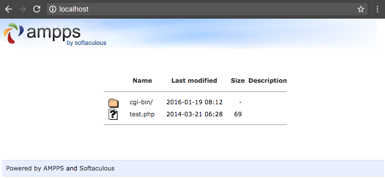

## File Manager

With this file manager you can easily manage your files and directories. You can:
- Create new directories;
- Upload files who have less then 2 MB, like: <em>.JPEG/.JPG/.PNG/ .PDF/.DOC/.DOCX/.TXT/.PPT/.PPTX/.ODS/.XLS;</em>
.XLSX,.ODT,.HTML,.HTM;
- Download files;
- Delete files;

<h4>How to use File Manager</h4>
First, check that in your computer is installed AMPPS, if not download it:
- <a href="https://ampps.com/downloads">AMPPS download</a>;

Then follow these steps:
- Downloads this repository ZIP file;
- Extract that file and move it to the folder named <b>www</b> you can find it in <b>C:\Program Files\Ampps</b>. If you don't found it, check where you installed AMPPS;
- Go to browser and in web address field write http://localhost/ and press enter.
- When you see something like that, find "file_manager" file and open it:

- Then enter username and password: 
<b>username:</b> Aurelija 
<b>password:</b> 1234
- That's it, now you can use your file manager.😊
